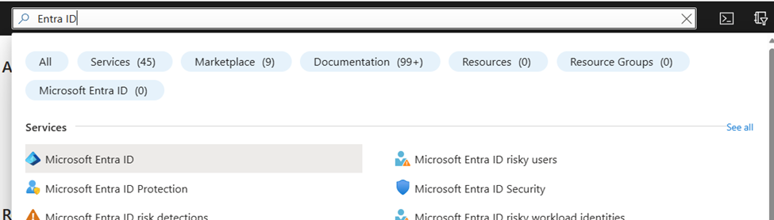
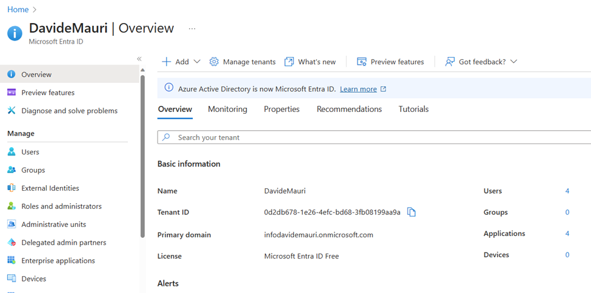
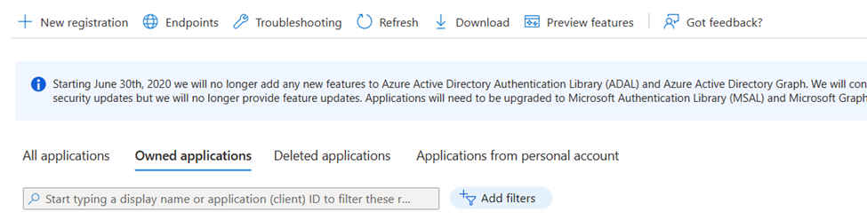
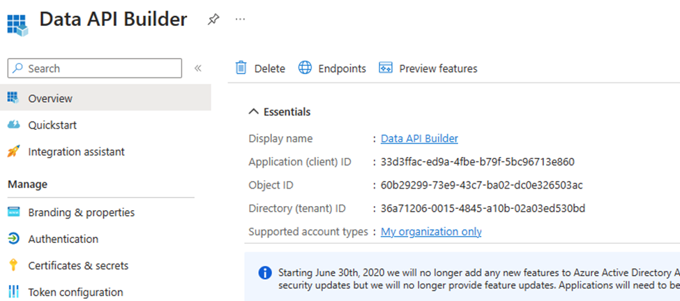
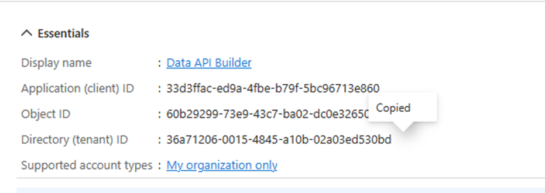
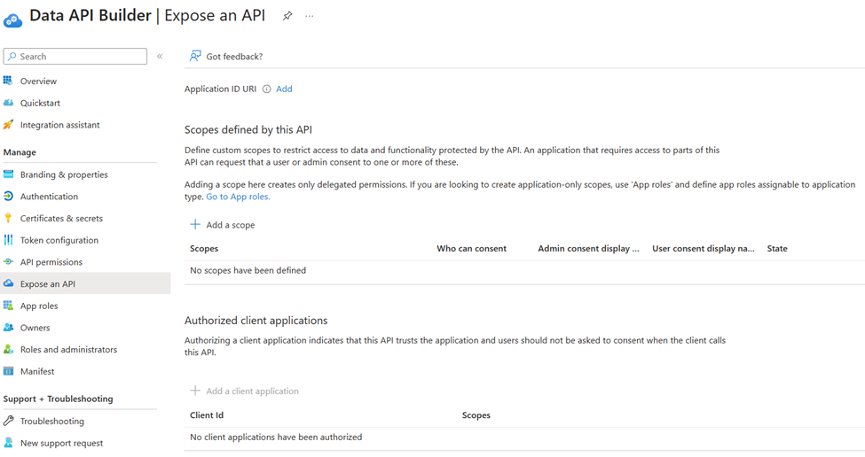
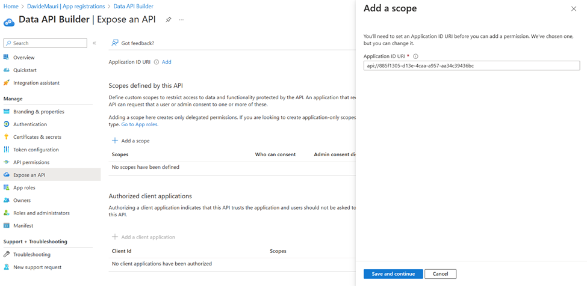
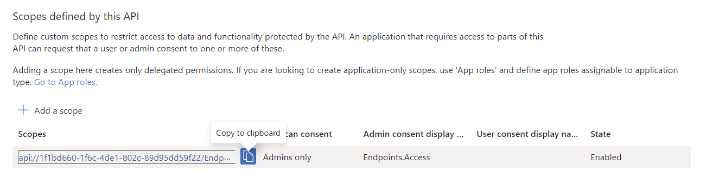

# Authenticate using EntraID with Data API builder from any Javascript client

## Pre-Requesites

- [AZ CLI](https://learn.microsoft.com/en-us/cli/azure/install-azure-cli?view=azure-cli-latest)
- [.NET 8](https://dotnet.microsoft.com/en-us/download/dotnet/8.0) 
- [VS Code](https://code.visualstudio.com/)
- [MSSQL](https://marketplace.visualstudio.com/items?itemName=ms-mssql.mssql) VS Code Extension
- [SQL Database Project](https://marketplace.visualstudio.com/items?itemName=ms-mssql.sql-database-projects-vscode) VS Code extension
- [Live Preview](https://marketplace.visualstudio.com/items?itemName=ms-vscode.live-server)
- [REST Client for Visual Studio Code](https://marketplace.visualstudio.com/items?itemName=humao.rest-client)

## Deploy the database

If you need a SQL Server database you can use the free SQL Server Developer Edition or [Azure SQL Free option](https://learn.microsoft.com/en-us/azure/azure-sql/database/free-offer?view=azuresql). 
The easiest way to get started is to use the Docker container for SQL Server. You can find the instructions in the [Local SQL Server container](https://learn.microsoft.com/en-us/sql/tools/visual-studio-code-extensions/mssql/mssql-local-container?view=sql-server-ver17) documentation.

This readme assumes that you are using the local SQL Server container for development.

## Install and test Data API builder

Create a `.env` file in the root of the project with the following content by copying the `.env.sample` file. The sample file is already configured to work with the development environment, so unless you want to change something (for example connect to a differnt server or database, you can leave it as is).

Open the terminal and run 

```bash
dotnet tool install Microsoft.DataApibuilder -g
```

to install Data API builder, then

```
dab start -c config/dab-config-noauth.json --no-https-redirect
```

to run Data API builder. The provided configuration exposes the tables

- `web.speakers`
- `web.sessions`

as REST and GraphQL endpoints, allowing access to anyone, without no need for authentication and authorization.

Right click on the `index.html` file and select "Open with Live Server" to start the application. The simple HTML app, uses GraphQL to query the database via the exposed GraphQL endpoint.

Since there is no authentication nor authorization configured, anyone can access the data. As a result, all the session stored in the database are returned and visualized by the HTML page.

## Add authentication via EntraID

### Register the Data API builder application

Open the Azure Portal and Search for "Entra ID"

()

and then open the Entra ID blade. 



Go to App Registrations and click on "New Registration"



Name it "Data API Builder" and select the most appropriate account type for you. For this example we'll use "Accounts in this organization only". 

Click "Register" and then copy the generated "Application (client) ID".



into your DAB config, so that the `authentication` section looks like the following (your "Application (client) ID" will be different than the one showed below and in the pictures, which is use just as an example):

```
"authentication": {
    "provider": "AzureAD",
    "jwt": {
        "issuer": "",
        "audience": " 33d3ffac-ed9a-4fbe-b79f-5bc96713e860"
    }
}
```

Now identify the "Directory (tenant) ID" value



And add it in the form of

`https://login.microsoftonline.com/<tenant-id>/v2.0`

to the configuration file

```
"authentication": {
    "provider": "AzureAD",
    "jwt": {
        "issuer": "https://login.microsoftonline.com/36a71206-0015-4845-a10b-02a03ed530bd/v2.0",
        "audience": "33d3ffac-ed9a-4fbe-b79f-5bc96713e860"
    }
},
```

Now click on "Expose an API" and then "Add a Scope":



Accept the provided Application ID Uri and click on "Save and continue".



Create a scope named `Endpoints.Access`. Allow Admins and/or User to consent depending on the security level you want to set.

Get the "Scope ID" as it will be needed later:



## Configure Data API builder permissions

Now Data API builder is able to authenticate users via Entra ID. A sample of the authorization options that Data API builder allows is available in `./config/dab-config-auth.json` file.

The "Session" entity has been configured to allow only `authenticated` request. The value returned are only those that match the user's identity by comparing the value of the claim `oid` to the value of the column `owner`.

```
"permissions": [
    {
        "role": "authenticated",
        "actions": [{
            "action": "read",
            "policy": {
            "database": "@claims.oid eq @item.owner"
            }
        }]
    }
],
```

## Test Entra ID authorization

Make sure you log in and have access to the created scope in your tenant (replace "<Scope ID>" and "<Tenant ID>" with the values you retrieved in the previous steps):

```
az login --scope "<Scope ID>" --tenant "<Tenant ID>"
```

Then get the access token:

```
az account get-access-token  --scope "<Scope ID>" --tenant "<Tenant ID>"
```

You'll get an access token that you can use to authenticate your requests to the Data API builder. 

Decode the token passing the value of the `accessToken` property returned by the previous command to a JWT decoder tool like [http://jwt.ms].

Get the value of `oid` claim from the decoded token and run the `./db/update-owner.sql` script to update the owner of the session, replacing `OBJECT_ID` with the value you just obtained.

The update script will set the user identified by the `oid` as the owner of the session.

Now you can run Data API builder with the following command:

```bash
dab start -c config/dab-config-auth.json --no-https-redirect
```

to load the configuration and start the API builder. You should see output indicating that the API builder is running and ready to accept requests. Data API builder now expect users to be authenticated in order to return data for the "Session" endpoint.

Create a `test-auth.http` file copying the provided `test-auth.http.template` file. Open the `test-auth.http` file and send the GET request: you'll get a `401 Unauthorized` response as there is no bearer token included in the request.

Add the bearer token to the request headers:

```
GET http://localhost:5000/api/sessions
Authorization: Bearer <your_access_token>
```

Now send the request and you should get a `200 OK` response with the session data that you own, as the owner of the session was set to the user identified by the `oid` claim in the access token.